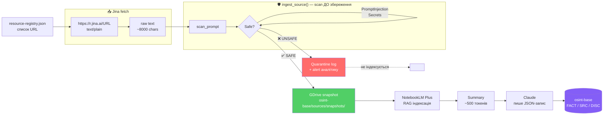
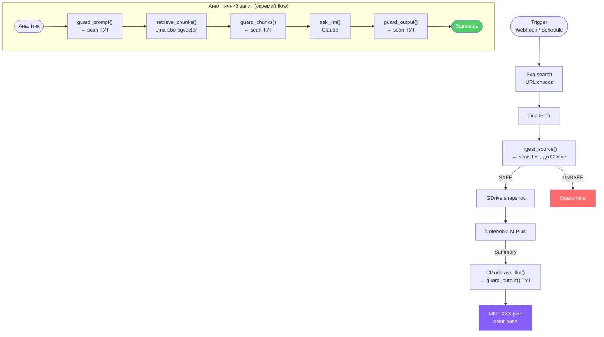

# П4 — LLM Guard: захист RAG на рівні retrieval

**Чому це окремий кейс від П3:**  
П3 (injection guard у промпті) захищає вхід від користувача.  
LLM Guard захищає **retrieved documents** — те що приходить з ворожих сайтів через Jina.  
В OSINT ці два шари захищають різні речі.

---

## Граф алгоритму: повний flow захисту

### Request-time pipeline (реальний час)

```mermaid
flowchart TD
    U([Аналітик\nпитання]) --> GP

    subgraph INPUT ["🛡️ Шар 1 — guard_prompt()"]
        GP[scan_prompt] --> S1{Safe?}
        S1 -- "PromptInjection\nTokenLimit\nSecrets" --> S1
    end

    S1 -->|❌ injection / overflow| E1[HTTP 400\nstage: input\nscores: {...}]
    S1 -->|✅ clean query| RC

    subgraph RETRIEVAL ["📥 Retrieval — Jina fetch"]
        RC[retrieve_chunks\nhttps://r.jina.ai/URL] --> RAW[raw chunks\nvid vorozhykh saitiv]
    end

    RAW --> GC

    subgraph CHUNKS ["🛡️ Шар 2 — guard_chunks()"]
        GC[scan кожен chunk] --> S2{All safe?}
        S2 -- "PromptInjection\nSecrets" --> S2
    end

    S2 -->|❌ всі отруєні| E2[HTTP 422\nNo safe context]
    S2 -->|✅ safe chunks ≤4| LLM

    subgraph LLM_CALL ["🤖 LLM — ask_llm()"]
        LLM[Claude Sonnet 4.6\nAnthropic API] --> ANS[raw answer]
    end

    ANS --> GO

    subgraph OUTPUT ["🛡️ Шар 3 — guard_output()"]
        GO[scan_output] --> S3{Valid?}
        S3 -- "Relevance ≥0.5\nSensitive redact" --> S3
    end

    S3 -->|❌ off-topic / leak| E3[HTTP 422\nstage: output]
    S3 -->|✅ clean answer| R([Відповідь\nаналітику])

    style E1 fill:#ff6b6b,color:#fff
    style E2 fill:#ff6b6b,color:#fff
    style E3 fill:#ff6b6b,color:#fff
    style R fill:#51cf66,color:#fff
    style U fill:#339af0,color:#fff
```

---

### Ingestion-time pipeline (фонова індексація)



---

### Де стоїть кожен шар у нашому n8n workflow



---

## Де атака відбувається в RAG

```
Стандартна injection:
  [Зловмисник] → [User input] → LLM
  Захист: prompt-level rule (П3)

RAG injection (небезпечніша):
  [Ворожий сайт] → [Jina fetch] → [Retrieved chunk] → [Context] → LLM
  Захист: scan_retrieved_chunks()  ← цього немає в П3
```

У нашому OSINT pipeline ми ретривимо з pravmir.ru, artos.org, hramozdatel.ru —
джерел що потенційно контролюються суб'єктами дослідження.
Будь-який з них може містити приховані інструкції в HTML або тексті.

---

## Production скелет: FastAPI + RAG + LLM Guard

Офіційний патерн Protect AI: `scan_prompt(...)` → LLM → `scan_output(...)`.

```python
import os
from fastapi import FastAPI, HTTPException
from pydantic import BaseModel
from openai import OpenAI
from llm_guard import scan_prompt, scan_output
from llm_guard.input_scanners import PromptInjection, TokenLimit, Secrets
from llm_guard.output_scanners import Relevance, Sensitive

app = FastAPI()
llm = OpenAI(api_key=os.environ["OPENAI_API_KEY"])

IN_SCANNERS  = [PromptInjection(), TokenLimit(), Secrets()]
OUT_SCANNERS = [Relevance(threshold=0.5), Sensitive(redact=True)]


class Req(BaseModel):
    question: str


def retrieve_chunks(query: str) -> list[str]:
    # заміни на свій vector DB / hybrid retriever
    # для OSINT: Jina fetch → список текстових фрагментів
    return ["...chunk 1...", "...chunk 2..."]


def guard_prompt(text: str) -> str:
    clean, valid, scores = scan_prompt(IN_SCANNERS, text)
    if not all(valid.values()):
        raise HTTPException(400, {"stage": "input", "scores": scores})
    return clean


def guard_chunks(chunks: list[str]) -> list[str]:
    safe = []
    scanners = [PromptInjection(), Secrets()]
    for chunk in chunks:
        clean, valid, _ = scan_prompt(scanners, chunk)
        if all(valid.values()):
            safe.append(clean)
    if not safe:
        raise HTTPException(422, "No safe context")
    return safe[:4]


def ask_llm(question: str, context: str) -> str:
    resp = llm.chat.completions.create(
        model="gpt-4o-mini",
        temperature=0,
        messages=[
            {"role": "system",
             "content": "Answer only from context. If context is insufficient, say you don't know."},
            {"role": "user",
             "content": f"Question:\n{question}\n\nContext:\n{context}"},
        ],
    )
    return resp.choices[0].message.content or ""


def guard_output(question: str, answer: str) -> str:
    clean, valid, scores = scan_output(OUT_SCANNERS, question, answer)
    if not all(valid.values()):
        raise HTTPException(422, {"stage": "output", "scores": scores})
    return clean


@app.post("/chat")
def chat(req: Req):
    q       = guard_prompt(req.question)          # 1. захист user input
    chunks  = guard_chunks(retrieve_chunks(q))    # 2. захист retrieved chunks
    context = "\n\n---\n\n".join(chunks)
    answer  = ask_llm(q, context)                 # 3. виклик LLM
    answer  = guard_output(q, answer)             # 4. захист output
    return {"answer": answer, "chunks_used": len(chunks)}
```

### Що захищає кожен рядок

| Функція | Захищає від | Сканери |
|---|---|---|
| `guard_prompt()` | Injection у запиті аналітика, витік секретів, overflow | PromptInjection, TokenLimit, Secrets |
| `guard_chunks()` | **Injection у документах з ворожих сайтів** | PromptInjection, Secrets |
| `guard_output()` | Нерелевантна відповідь, витік чутливих даних | Relevance, Sensitive |

---

## Адаптація під наш OSINT pipeline

Замінити `retrieve_chunks()` на Jina fetch:

```python
def retrieve_chunks(query: str) -> list[str]:
    import urllib.request
    jina_key = os.environ["JINA_API_KEY"]
    # query тут = URL джерела з resource-registry.json
    req = urllib.request.Request(
        f"https://r.jina.ai/{query}",
        headers={"Authorization": f"Bearer {jina_key}",
                 "Accept": "text/plain"}
    )
    with urllib.request.urlopen(req) as r:
        text = r.read().decode()[:8000]
    return [text]  # один великий chunk або розбити по абзацах
```

Замінити `ask_llm()` на Claude:

```python
from anthropic import Anthropic

claude = Anthropic()

def ask_llm(question: str, context: str) -> str:
    msg = claude.messages.create(
        model="claude-sonnet-4-6",
        max_tokens=1024,
        messages=[{
            "role": "user",
            "content": (
                f"Ти OSINT-аналітик. Відповідай ЛИШЕ на основі контексту.\n\n"
                f"Гіпотеза: {question}\n\nДжерело:\n{context}"
            )
        }]
    )
    return msg.content[0].text
```

---

## Ingestion-time scanning — наступний рівень

**Поточна схема (retrieval-time):**
```
[Jina fetch] → guard_chunks() → [Context] → LLM
```

**Ідеальна схема (ingestion-time, рекомендація Protect AI):**
```
[Jina fetch] → guard_ingestion() → [Vector DB / GDrive snapshot] → retrieve → LLM
```

Scan під час ingestion — **до індексації**, не після retrieval.  
Це значно безпечніше: отруєний документ не потрапляє в базу взагалі.

```python
def ingest_source(url: str, domain: str):
    """Запускати при Jina fetch, перед збереженням snapshot."""
    raw_text = jina_fetch(url)

    # Scan перед збереженням
    scanners = [PromptInjection(), Secrets()]
    clean, valid, scores = scan_prompt(scanners, raw_text)

    if not all(valid.values()):
        # Quarantine — зберігаємо окремо для аудиту, не індексуємо
        save_quarantine(url, domain, raw_text, scores)
        return None

    # Безпечний документ → зберігаємо в osint-base/sources/snapshots/
    save_snapshot(url, domain, clean)
    return clean
```

### Де це стоїть у нашому n8n workflow

```
Trigger → Exa search → [URL список]
               ↓
         Jina fetch
               ↓
         ingest_source()  ← scan тут, до GDrive
         ├── SAFE   → GDrive snapshot → NotebookLM
         └── UNSAFE → Quarantine log  → alert
```

---

## Мінімальний набір сканерів для старту

**На вхід (user query + chunks):**
- `PromptInjection` — головний захист
- `Secrets` — щоб секрети з ENV не потрапили в логи
- `TokenLimit` — запобігає overflow

**На вихід (LLM відповідь):**
- `Relevance` — відповідь не "з'їхала" від гіпотези
- `Sensitive` — дані не витікають назовні

**Для production OSINT (додатково):**
- `FactualConsistency` — відповідь не суперечить джерелам (автоматична перевірка галюцинацій)

---

## Порівняння шарів захисту

| | П3 (SKILL v1.3) | П4 retrieval-time | П4 ingestion-time |
|---|---|---|---|
| Що захищає | Промпт аналітика | Chunk перед LLM | Документ перед базою |
| Механізм | Текстове правило | ML-модель | ML-модель |
| Отруєний doc у базі? | Так | Так | **Ні** |
| Залежності | Нуль | `llm-guard` | `llm-guard` |
| Рекомендація Protect AI | Базова гігієна | Достатньо для MVP | **Ідеальний варіант** |

У реальному OSINT-pipeline для чутливих кейсів — всі три шари обов'язкові.
