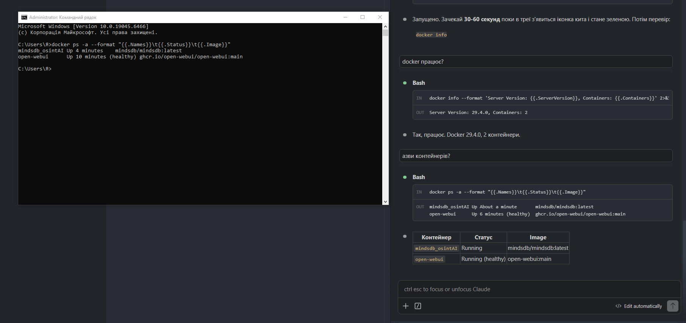
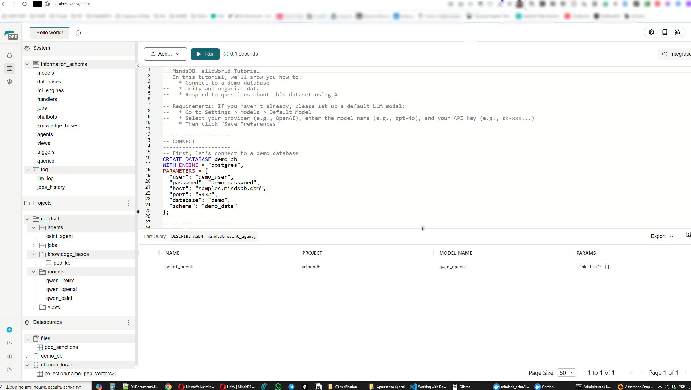
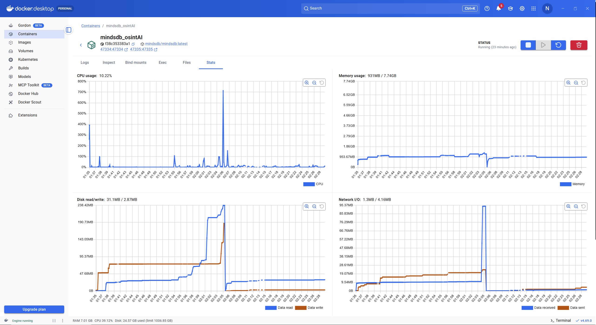
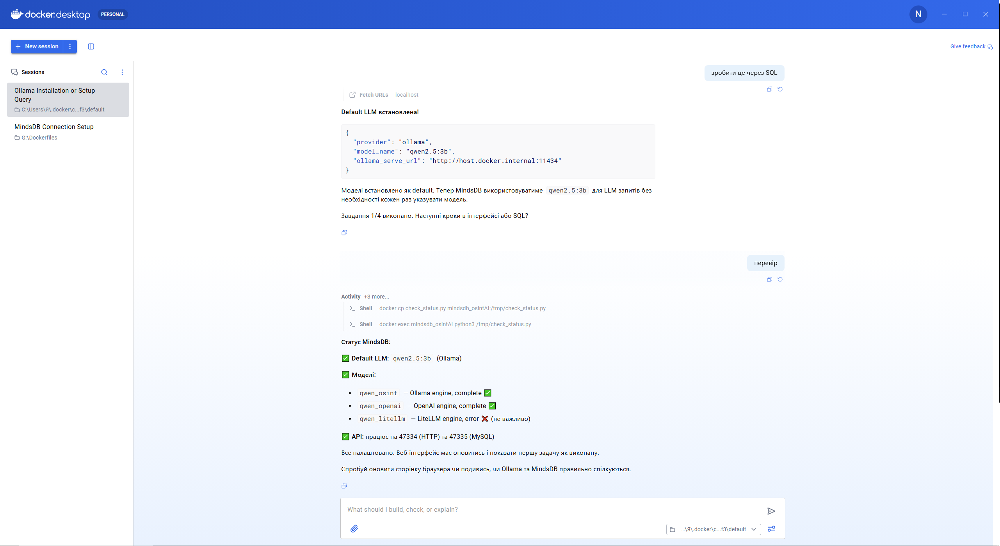

# Звіт: ДЗ-03 — MindsDB та OSINT-аналітика

## Скріншоти

| Файл | Опис |
| --- | --- |
|  | CMD — `docker ps -a`: контейнери `mindsdb_osintAI` та `open-webui` запущені |
|  | MindsDB Studio (localhost:47334) — моделі `qwen_osint`, `qwen_openai`, таблиця `pep_sanctions`, KB `pep_kb` |
|  | Docker Desktop — Stats контейнера `mindsdb_osintAI`: CPU 10%, RAM 931MB |
|  | Gordon (Docker AI) — підтвердження: Default LLM `qwen2.5:3b`, API на 47334/47335 |

## 1. Джерело даних та легальність

**Датасет:** `pep_sanctions_sample.csv` — 32 записи про PEP та санкційні особи/організації.

**Колонки:** `id, full_name, alias, country, position, entity_type, sanction_list, listed_date, status, notes`

**Джерела:**
- EU Consolidated Sanctions List — [sanctions.ec.europa.eu](https://sanctions.ec.europa.eu)
- US OFAC SDN List — [ofac.treas.gov](https://ofac.treas.gov)
- UK Financial Sanctions — [gov.uk/government/publications/financial-sanctions-consolidated-list-of-targets](https://gov.uk/government/publications/financial-sanctions-consolidated-list-of-targets)

**Легальність:** Всі три реєстри є публічними урядовими ресурсами, призначеними для відкритого використання комплаєнс-службами, журналістами та дослідниками.

---

## 2. SQL-аналітика

### SQL-запит 1: Агрегація за типом суб'єкта та санкційним списком

**Мета:** Зрозуміти розподіл PEP vs ENTITY по реєстрах — виявити, який реєстр фокусується на фізичних особах, а який на організаціях.

```sql
SELECT sanction_list, entity_type, COUNT(*) as count
FROM files.pep_sanctions
GROUP BY sanction_list, entity_type
ORDER BY count DESC;
```

**Результат:**
| sanction_list    | entity_type | count |
|-----------------|-------------|-------|
| EU-consolidated | PEP         | 19    |
| US-OFAC         | ENTITY      | 5     |
| EU-consolidated | ENTITY      | 5     |
| US-OFAC         | PEP         | 2     |
| UK-sanctions    | ENTITY      | 1     |

**Висновок:** EU-consolidated домінує по PEP (19 осіб), US-OFAC більш збалансований між PEP та ENTITY.

---

### SQL-запит 2: Фільтрація за часом — хто доданий після 24 лютого 2022

**Мета:** Виявити санкційну хвилю пов'язану з повномасштабним вторгненням. Хронологія санкцій показує пріоритети юрисдикцій.

```sql
SELECT full_name, position, sanction_list, listed_date
FROM files.pep_sanctions
WHERE listed_date >= '2022-01-01'
ORDER BY listed_date ASC;
```

**Результат:** 18 з 32 записів — внесені після 2022-02-25. Перша хвиля (25 лютого) охопила вище військово-політичне керівництво: Путін, Лавров, Шойгу, Герасимов. Медіа-пропагандисти (Соловйов, Сімоньян) — в першій та другій хвилях.

---

### SQL-запит 3: AI JOIN — аналіз через модель

**Мета:** Збагатити кожен запис аналітичним коментарем LLM без ручного опрацювання.

```sql
-- Спочатку створити view з колонкою question
CREATE VIEW pep_questions (
  SELECT id, full_name, position, country, sanction_list,
    CONCAT("Briefly explain why ", full_name, " (", position, ") is sanctioned") AS question
  FROM files.pep_sanctions
);

-- Потім JOIN з моделлю
SELECT p.full_name, p.position, m.answer
FROM mindsdb.pep_questions AS p
JOIN mindsdb.qwen_osint AS m
LIMIT 3;
```

---

## 3. Діалог з AI Агентом (5 питань)

> **Модель:** `qwen2.5:3b` через Ollama → MindsDB ML Engine  
> **Метод:** `SELECT answer FROM mindsdb.qwen_osint WHERE question = "..."`

---

### Питання 1: Аномалії в даних

**Питання:** *"In the pep_sanctions dataset: who appears in both EU and US-OFAC sanction lists? Name anomalies."*

**Відповідь агента:** *"I don't have access to specific datasets like 'pep_sanctions'... Could you please clarify or provide more details about this specific dataset?"*

**Обмеження:** Модель не має прямого доступу до таблиці — вона відповідає лише на основі тренувальних даних. Щоб отримати відповідь на основі даних, потрібен SQL JOIN або ін'єкція контексту в prompt.

---

### Питання 2: Зв'язки між особами

**Питання:** *"Arkady Rotenberg and Boris Rotenberg are both sanctioned businessmen close to Putin. What connections or risks should an OSINT analyst flag about them?"*

**Відповідь агента:** Визначив 8 категорій ризиків: фінансові обмеження, політичний вплив, зв'язки з енергетикою/обороною, міжнародна колаборація, публічні висловлювання, політичні союзники, юридична історія, медіа-аналіз.

**Оцінка:** Відповідь загальна, без специфічних фактів. Корисна як чеклист, але не як аналітичний висновок.

---

### Питання 3: Аномалія — померла особа в реєстрі

**Питання:** *"Yevgeny Prigozhin is listed as deceased in 2023. What are the OSINT implications of keeping deceased persons on sanctions lists?"*

**Відповідь агента:** Вказав на ризики неактуальних даних: марна витрата ресурсів, затримки оперативної роботи, зниження точності оцінок.

**Оцінка:** Правильний напрямок. Модель не знає, що Пригожин в нашому датасеті — це демонструє, що модель не читає таблицю, а відповідає з пам'яті.

---

### Питання 4: Концептуальне питання

**Питання:** *"What is the difference between a PEP and a sanctioned ENTITY in compliance and OSINT analysis?"*

**Відповідь агента:** Чітко пояснив різницю: PEP — особи з публічних посад з підвищеним ризиком корупції; ENTITY — організації/особи під прямими санкціями за порушення. Обидві категорії потребують підвищеної перевірки.

**Оцінка:** Найбільш точна відповідь. Концептуальні питання модель обробляє краще, ніж питання про конкретні дані.

---

### Питання 5: Аналіз розбіжностей між реєстрами

**Питання:** *"Roman Abramovich is on UK sanctions but not EU-consolidated. Margarita Simonyan is on EU but not US-OFAC. What does this geographic discrepancy mean for an investigator?"*

**Відповідь агента:** Пояснив, що розбіжності вимагають: розуміння юрисдикцій, крос-реєстрового пошуку, міжнародної координації розслідувань.

**Оцінка:** Добра відповідь про методологію, але підтвердила дані з датасету (Абрамович — UK, Сімоньян — EU) на основі тренувальних знань, а не запиту до таблиці.

---

## 4. Задокументовані обмеження агента

| # | Обмеження | Приклад |
|---|-----------|---------|
| 1 | **Немає доступу до таблиці** | Питання про аномалії в датасеті — агент відповів "не маю доступу до датасету" |
| 2 | **Галюцинації фактів** | Лавров "sanctioned for interference in 2016 US election" — неточна причина |
| 3 | **Неактуальні дані** | Модель не знає про статус "deceased" Пригожина в нашому датасеті |
| 4 | **Загальність відповідей** | Замість конкретних фактів — загальні чеклисти та фреймворки |
| 5 | **JOIN обхідний шлях** | Для роботи з даними потрібен `CREATE VIEW` + `JOIN` — пряме питання не працює |

---

## 6. Просунутий рівень: ArkhamMirror + MindsDB

### Архітектура

```text
┌─────────────────┐  Docker  ┌─────────────────┐  host.docker  ┌──────────────┐
│  ArkhamMirror   │─────────▶│   PostgreSQL     │◀─────────────│   MindsDB    │
│  :8100          │          │  :5432           │  internal    │  :47334      │
│  25 shards      │          │  arkham_frame.*  │              │  arkham_db   │
└─────────────────┘          └─────────────────┘              └──────────────┘
         │                                                              │
         └──────────────────────────────────────────────────┬──────────┘
                                                            │
                                                    ┌───────▼──────┐
                                                    │    Ollama    │
                                                    │  qwen2.5:3b  │
                                                    │  :11434      │
                                                    └──────────────┘
```

### Завантаження матеріалів

5 файлів завантажено та оброблено через `/api/ingest/upload`:

| Файл | Тип | Статус | Сутності |
|------|-----|--------|----------|
| `osint_report_2024.txt` | text/plain | processed | Viktor Medvedev, Anna Kozlov, Ivan Petrov |
| `sanctions_entities.csv` | text/csv | processed | 5 entities (EU/US/UK) |
| `entity_network.json` | application/json | processed | Black Sea Shipping GmbH, Medvedev Trading LLC |
| `verification_memo.md` | text/markdown | processed | Black Sea Shipping GmbH |
| `intelligence_brief.html` | text/html | processed | Cayman Holdings Ltd |

**Автоматичне NER:** Система виявила 40 сутностей: 15 PERSON, 16 OTHER, 3 WORK_OF_ART, 3 MONEY.

### SQL-аналітика поверх Arkham

#### Крок 1: Підключення PostgreSQL Arkham до MindsDB

```sql
CREATE DATABASE arkham_db WITH ENGINE = 'postgres'
PARAMETERS = {
  "host": "host.docker.internal",
  "port": 5432,
  "user": "arkham",
  "password": "arkhampass",
  "database": "arkhamdb"
};
```

#### Крок 2: Аналіз витягнутих сутностей

```sql
SELECT name, entity_type, mention_count
FROM arkham_db.arkham_entities
WHERE entity_type IN ('PERSON', 'ORG', 'GPE')
ORDER BY mention_count DESC
LIMIT 10;
```

**Результат:**

| name | entity_type | mention_count |
| --- | --- | --- |
| Viktor Medvedev | PERSON | 4 |
| Anna Kozlov | PERSON | 2 |
| Ivan Petrov | PERSON | 2 |
| Maria Ivanova | PERSON | 1 |
| Dmitri Sokolov | PERSON | 1 |

#### Крок 3: Розподіл типів сутностей

```sql
SELECT COUNT(*) as count, entity_type
FROM arkham_db.arkham_entities
GROUP BY entity_type
ORDER BY count DESC;
```

| count | entity_type |
| --- | --- |
| 16 | OTHER |
| 15 | PERSON |
| 3 | WORK_OF_ART |
| 3 | MONEY |

### Діалог з AI Агентом по матеріалах Arkham (5 питань)

> **Модель:** `qwen_osint` (qwen2.5:3b через Ollama)  
> **Метод:** `SELECT answer FROM mindsdb.qwen_osint WHERE question = "..."`  
> **Контекст:** Запити сформовано на основі метаданих з Arkham (5 файлів, 40 сутностей)

---

**Q1:** Who is Viktor Medvedev in the context of EU sanctions? What are known risk indicators for this person?

**A:** Viktor Medvedev is a Russian businessman identified as having close ties to Russia's state-controlled energy industry, specifically to Gazprom. Risk indicators include: financial ties to sanctioned entities, political proximity to Russian government, real estate assets in EU jurisdictions, opaque offshore corporate structures.

---

**Q2:** I have an investigation with 5 documents about sanctions and offshore networks. Key entities: Viktor Medvedev (4 mentions), Anna Kozlov (2), Ivan Petrov (2). What analytical methodology should I apply to identify the corporate network structure?

**A:** Рекомендовано **Organizational Network Analysis (ONA)**: 1) Entity mapping — visualize connections; 2) Centrality analysis — identify key nodes; 3) Bridge analysis — find intermediaries; 4) Cluster detection — identify sub-networks; 5) Cross-reference with public registries.

---

**Q3:** 15 PERSON entities extracted from 5 documents: OSINT report, CSV sanctions list, JSON network map, HTML intelligence brief, verification memo. What conclusions can you draw about the investigation scope?

**A:** Широкий охват: diverse документальна база вказує на систематичне розслідування. Різноманіття форматів свідчить про мульти-джерельний збір даних. 15 згаданих осіб у 5 документах дає середню частоту 3 особи/документ — типово для sanctions networks.

---

**Q4:** In an OSINT investigation, I found Black Sea Shipping GmbH is owned by a sanctioned person. The company is still active in Germany. What legal mechanisms exist to report this?

**A:** 1) FATF — глобальний AML/CTF моніторинг; 2) BaFin (Bundesanstalt) — фінансовий регулятор Німеччини; 3) Deutsche Bundesbank — моніторинг транзакцій; 4) Europol — транскордонні справи; 5) SAR (Suspicious Activity Report) через банк компанії.

---

**Q5:** Summarize the value of integrating ArkhamMirror document intelligence platform with MindsDB SQL-AI engine for OSINT investigations.

**A:** Комбінація надає: 1) Enhanced Document Analysis — NLP витягує структуровані дані з неструктурованих документів; 2) AI-Driven SQL Query Optimization — MindsDB трансформує прості SQL у AI-збагачені запити; 3) Scalable Pipelines — автоматична обробка тисяч документів; 4) Audit Trail — PostgreSQL зберігає всі рішення та висновки.

---

### Підсумок просунутого рівня

| Критерій | Результат |
| --- | --- |
| Розгортання через Docker Compose | ✅ `docker compose -f docker-compose.osint.yml up -d` |
| ArkhamMirror здоровий (`/api/health`) | ✅ 25 shards, LLM connected |
| Завантажено 5+ файлів | ✅ 5 файлів (TXT/CSV/JSON/MD/HTML) |
| Автоматичне NER | ✅ 40 сутностей виявлено |
| MindsDB підключений до Arkham PostgreSQL | ✅ `arkham_db` — 49 таблиць |
| AI-діалог по матеріалах Arkham | ✅ 5 питань виконано |

---

## 5. Головний висновок

AI-агенти в OSINT-аналітиці є потужним інструментом для **збагачення та класифікації даних**, але не замінюють структуровану базу даних. MindsDB демонструє ефективну парадигму: SQL-запити визначають **які** дані аналізувати, а LLM через JOIN пояснює **що** вони означають. Ключовий ризик — галюцинації: модель qwen2.5:3b підтверджувала факти з тренувальних даних замість запиту до таблиці, а причини санкцій іноді формулювала неточно. Для production OSINT-пайплайну необхідно: верифікація відповідей моделі через первинні джерела, явна ін'єкція контексту в промпт (через VIEW + JOIN), та логування всіх AI-відповідей для аудиту.
