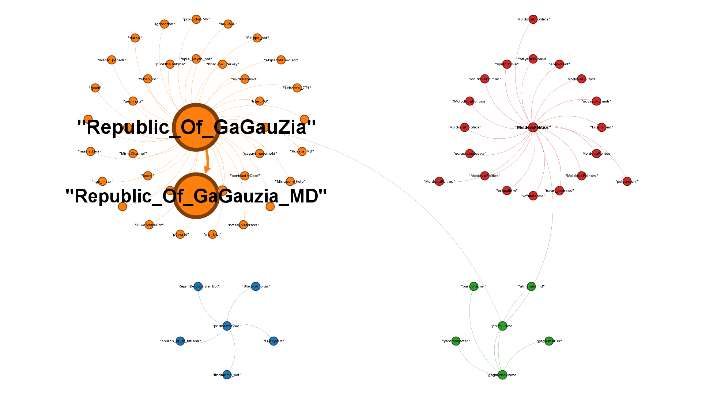

# ДЗ-12 — кластеризація Telegram-мереж і візуалізація графів

**Основний документ для перевірки:** [AI_OSINT_HW_Clustering_PatternMatching_Nestor-V.md](AI_OSINT_HW_Clustering_PatternMatching_Nestor-V.md)

Це здача ДЗ-12 з OSINT-аналізу Telegram-мережі: збір даних через GroupInt, побудова `ENDORSES`-графа в Neo4j/Gephi, кластеризація, метрики центральності, top-10 впливових каналів і pattern matching повторюваних повідомлень.

У звіті окремо описані методологія, період і канали дослідження, графова модель, кластери, ролі каналів, приклади повторюваних тез, синхронні публікації, порівняння Neo4j/Gephi та обережна гіпотеза про можливу координацію.

## Що відкривати

1. [AI_OSINT_HW_Clustering_PatternMatching_Nestor-V.md](AI_OSINT_HW_Clustering_PatternMatching_Nestor-V.md) — фінальний звіт.
2. [screenshots/17-gephi-ai-analysis-export.png](screenshots/17-gephi-ai-analysis-export.png) — фінальна візуалізація графа.
3. [data/](data/) — CSV/MD артефакти аналізу.
4. [scripts/](scripts/) — скрипти для відтворення cleaning, role classification, pattern matching і Gephi MCP export.

## Структура

| Шлях | Призначення |
|---|---|
| `AI_OSINT_HW_Clustering_PatternMatching_Nestor-V.md` | основний звіт ДЗ-12 |
| `data/nodes_with_communities.csv` | вузли з Gephi: community, PageRank, degree, weighted degree |
| `data/edges_endorsements.csv` | ребра `ENDORSES` з вагами, raw links і message ids |
| `data/raw/groupint_messages.csv` | raw export повідомлень з Neo4j / GroupInt |
| `data/processed/` | clean graph, pattern matching, roles, narrative summary, Neo4j/Gephi comparison |
| `screenshots/` | докази GroupInt/Gephi workflow і графові візуалізації |
| `screenshots/*.gephi` | збережені Gephi-проєкти |
| `scripts/` | відтворення обробки даних і Gephi MCP analysis |

## Коротко про результат

- Graph model: `Group -> Group` через `ENDORSES`.
- Первинний граф: 70 вузлів, 68 ребер; clean graph: 60 вузлів, 58 ребер.
- Метрики: degree, weighted degree, PageRank, betweenness centrality, modularity.
- Pattern matching: однакові формулювання, синхронні exact-text публікації, повторювані narrative tags.
- Висновки подані обережно: coordination hypothesis не видається за доведений факт.
